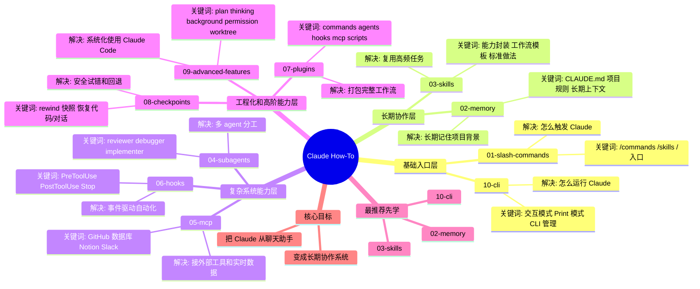

# Claude How-To 单页脑图版

## 一句话总结

- `01 + 10`：先会触发、会运行
- `02 + 03`：再让 Claude 稳定合作、复用经验
- `04 + 05 + 06`：再学分工、接工具、做自动化
- `07 + 08 + 09`：最后把能力打包、回退、系统化

## 最短学习路径

1. `10-cli`
2. `02-memory`
3. `03-skills`
4. `04-subagents`
5. `07-plugins`
6. `08-checkpoints`
7. `09-advanced-features`

## 最终目标

这个项目真正想教你的不是“Claude 有哪些功能”，而是：

- 怎么建立长期协作规则
- 怎么沉淀高频任务
- 怎么让 Claude 分工和接工具
- 怎么把工作流工程化
