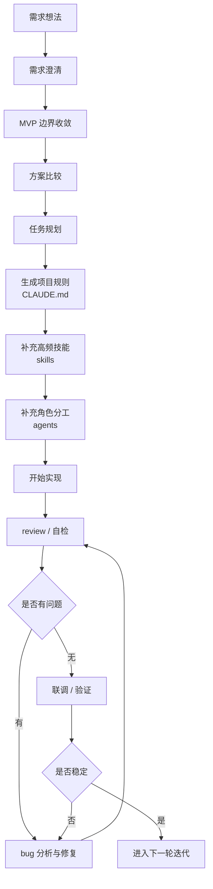

# Claude 从需求到上线全流程图

## 文档目的

这份文档把前面整理的两大部分串起来：

- 前期：需求分析、方案设计、任务规划
- 开发期：实现、review、bugfix、协作框架

目标是用一张总流程图，帮助你理解如何在项目里把 Claude 从“需求阶段”一路用到“开发落地阶段”。

---

## 一、总流程图



---

## 二、按阶段理解这条流程

## 1. 需求阶段

这一阶段的重点不是写代码，而是把问题定义清楚。

要解决：

- 需求到底要解决什么问题
- 用户是谁
- 第一版边界是什么
- 什么先做，什么不做

对应动作：

- 让 Claude 做需求澄清
- 让 Claude 帮你收敛 MVP

推荐口径：

```text
先不要写代码。
请帮我把这个需求整理成清晰版本，输出问题定义、目标用户、核心场景、MVP 和风险点。
```

---

## 2. 方案阶段

这一阶段的重点是“比较方案”，而不是“直接选一个写”。

要解决：

- 有几种可行方案
- 各自复杂度和风险如何
- 哪个最适合当前阶段

对应动作：

- 让 Claude 给 2-3 种方案
- 明确 tradeoff
- 选推荐方案

推荐口径：

```text
请给我 2-3 种实现方案，比较开发速度、复杂度、维护成本和风险，最后给推荐方案。
```

---

## 3. 任务规划阶段

这一阶段决定后面开发会不会乱。

要解决：

- 任务怎么拆
- 先做什么
- 每一步怎么验证

对应动作：

- 让 Claude 拆小任务
- 标顺序和依赖
- 把工作节奏设计出来

推荐口径：

```text
请把这个需求拆成小任务，要求每一步边界清晰、顺序合理、可独立验证。
```

---

## 4. 项目规则搭建阶段

这一阶段开始把“思路”固化成“协作框架”。

要解决：

- Claude 长期要记住什么
- 哪些任务以后要复用
- 哪些角色要分工

对应动作：

- 生成 `CLAUDE.md`
- 建立基础 skills
- 建立基础 agents

最小推荐：

- `CLAUDE.md`
- `review skill`
- `bugfix skill`
- `implementer agent`
- `debugger agent`
- `reviewer agent`

---

## 5. 开发实现阶段

这一阶段才是真正开始改代码。

要解决：

- 新功能怎么稳妥落地
- 复杂改动怎么控范围
- 如何减少回归风险

对应动作：

- 用 `feature skill`
- 用 `implementer agent`
- 按小步推进

推荐口径：

```text
先分析影响范围，再给一个小步实施计划，等我确认后再实现。
```

---

## 6. 审查阶段

这一阶段不是可选项，而是让输出变稳定的关键。

要解决：

- 有没有回归风险
- 有没有测试缺口
- 有没有复杂度不必要地升高

对应动作：

- 用 `review skill`
- 用 `reviewer agent`
- findings first

推荐口径：

```text
请从 reviewer 的角度检查这次改动，重点看回归风险、测试缺口和可维护性。
```

---

## 7. Bugfix 阶段

这一阶段在开发中会不断循环出现。

要解决：

- bug 根因是什么
- 最小修复方案是什么
- 修完后如何验证

对应动作：

- 用 `bugfix skill`
- 用 `debugger agent`
- 先定位，再修复

推荐口径：

```text
先不要改代码，先定位根因，给我最可能的原因、相关文件和最小修复方案。
```

---

## 8. 联调和验证阶段

这一阶段尤其适合全栈项目。

要解决：

- 前后端是否对上
- 用户流程是否跑通
- 是否还有跨模块残余风险

对应动作：

- 说明前端影响
- 说明后端影响
- 说明联调路径
- 说明残余风险

---

## 9. 进入下一轮迭代

项目不是一次性结束，而是不断循环。

进入下一轮前，建议做两件事：

1. 把这轮形成的规则补进 `CLAUDE.md`
2. 把高频任务沉淀成 skill / agent / hook

也就是说：

每做完一轮，Claude 的协作框架都应该比之前更成熟一点。

---

## 三、按项目类型怎么套这条流程

## 通用项目

用法：

- 先用通用规则跑完整条链路
- 后续再按项目偏向细化

## 前端项目

重点关注：

- UI
- 交互
- 状态
- 样式和响应式

## 后端项目

重点关注：

- 接口契约
- 数据一致性
- 日志
- 并发 / 事务 / 缓存 / 消息

## 全栈项目

重点关注：

- 先拆前后端边界
- 前端任务用前端 skill / agent
- 后端任务用后端 skill / agent
- 最后再做联调验证

---

## 四、最推荐的 Claude 使用节奏

如果你想把 Claude 真正用顺，最推荐的节奏是：

1. 需求阶段让 Claude 帮你想清楚
2. 方案阶段让 Claude 帮你比较清楚
3. 规划阶段让 Claude 帮你拆清楚
4. 开发阶段让 Claude 帮你做出来
5. review 阶段让 Claude 帮你查出来
6. bugfix 阶段让 Claude 帮你修清楚
7. 每轮结束后，把经验沉淀下来

一句话：

**Claude 最强的用法不是“替你写代码”，而是“陪你从需求一路走到稳定落地”。**

---

## 五、一句话总总结

从需求到上线，Claude 最有价值的链路不是某个单点功能，而是一整套工作流：

**需求澄清 -> 方案比较 -> 任务规划 -> 规则固化 -> 实现 -> review -> bugfix -> 联调验证 -> 经验沉淀**
