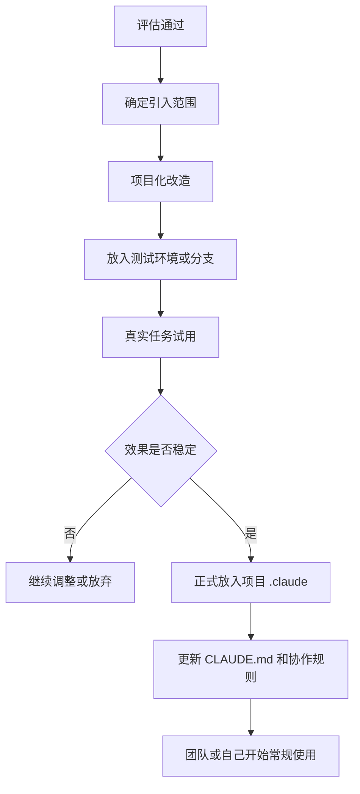

# Claude 外部能力引入后的标准落地流程

## 文档目的

前一份文档解决的是：

- 外部 skill / plugin / MCP / hook 值不值得引入

这份文档补的是后半段：

**当评估通过后，怎么把它真正安全、稳定地落到项目里。**

也就是从：

- 评估通过

走到：

- 放进项目 `.claude/`
- 调整命名和规则
- 小范围试用
- 正式纳入项目协作框架

---

## 一、总原则

**不要把“评估通过”理解成“可以原样复制进主项目”。**

正确顺序应该是：

1. 先确定引入范围
2. 再做项目化改造
3. 再小范围试用
4. 再正式并入主项目
5. 最后更新项目规则

一句话：

**评估通过只是开始，不是结束。**

---

## 二、标准落地流程总览



---

## 三、第一步：确定引入范围

先决定它应该放在哪一层。

### 1. 项目级

放在项目目录里，例如：

```text
project/
  CLAUDE.md
  .claude/
```

适合：

- 和项目强相关
- 团队共享
- 需要纳入版本管理

### 2. 用户级

放在个人配置里，例如：

```text
~/.claude/skills/
~/.claude/agents/
```

适合：

- 个人通用习惯
- 不依赖某个项目

### 3. 测试级

先放到：

- 测试项目
- 独立分支
- 临时试验目录

适合：

- 还不确定是否好用
- 风险较高
- 结构较复杂

### 推荐原则

- 项目相关的，优先项目级
- 个人通用的，优先用户级
- 风险大的，先测试级

---

## 四、第二步：项目化改造

这是最关键的一步。

### 为什么不能直接原样复制

因为外部能力通常不是为你的项目写的，原样复制很容易出现：

- 命名冲突
- 输出风格不符
- 职责重叠
- 权限不合适

### 改造时重点看什么

#### 1. 命名

把太泛的名字改成项目里更清楚的名字。

例如：

- `review` -> `frontend-review`
- `bugfix` -> `backend-bugfix`
- `implementer` -> `api-implementer`

#### 2. 描述

把说明改成更符合你项目的场景。

例如：

- 不要写“适合所有代码审查”
- 而是写“适合后台接口、服务层和数据一致性风险审查”

#### 3. 输出格式

统一到你的项目习惯。

例如：

- Findings first
- 改动说明必须包含风险
- bugfix 必须先给根因再给修法

#### 4. 权限和边界

尤其是：

- MCP
- hook
- plugin

要确认：

- 它能访问什么
- 它会自动做什么
- 它不该做什么

---

## 五、第三步：放入测试环境或分支

不要直接进主项目主分支。

### 推荐做法

#### 方案 A：先放测试项目

适合：

- skill
- agent
- 小型 hook

#### 方案 B：先放当前项目的独立分支

适合：

- 已经比较确定要用
- 但还想先观察

#### 方案 C：plugin / MCP 先只启一部分

适合：

- plugin 比较重
- MCP 权限较多

例如：

- plugin 只先引一个 command
- MCP 先只开只读能力

---

## 六、第四步：用真实任务试用

不要只看“它能不能加载”，要看“它能不能帮你做成事”。

### 试用时要观察的点

#### 对 skill

- 输出是不是更稳定了
- 是不是更符合项目口径
- 有没有减少重复提示

#### 对 agent

- 分工有没有更清楚
- 有没有和现有角色打架
- 有没有减少主会话混乱

#### 对 plugin

- 入口是不是更顺
- 工作流是不是更完整
- 会不会反而过重

#### 对 MCP

- 查询结果是不是有价值
- 权限是不是合理
- 会不会引入安全顾虑

#### 对 hook

- 有没有真的减少遗漏
- 会不会太打扰
- 触发频率是否合理

### 推荐试用口径

```text
这次我们试用这个新能力，但先按小范围观察。
请尽量按它的设计方式工作，同时保留我们现有协作规则。
最后请告诉我：
1. 它带来了什么提升
2. 它哪里不贴项目
3. 还需要做哪些本地化调整
```

---

## 七、第五步：正式放入项目 `.claude/`

当试用效果稳定后，再正式并入项目。

### 典型位置

#### skill

```text
project/.claude/skills/<name>/SKILL.md
```

#### agent

```text
project/.claude/agents/<name>.md
```

#### hook

```text
project/.claude/hooks/hooks.json
```

#### `CLAUDE.md`

```text
project/CLAUDE.md
```

### Plugin / MCP 怎么落

plugin 和 MCP 更建议：

- 先把真正要用的部分落地
- 不一定整套照搬

很多时候最好的做法不是“装整个 plugin”，而是：

- 借它的 command
- 借它的 agent
- 借它的 skill

然后改成你项目自己的版本。

---

## 八、第六步：更新 `CLAUDE.md` 和项目规则

这是经常被漏掉的一步。

如果一个外部能力已经正式并入项目，建议同步更新 `CLAUDE.md`，至少说明：

- 它是干什么的
- 什么时候该用
- 什么时候不该用

### 推荐补充方式

```md
## 项目协作补充

- 遇到代码审查任务，优先使用 `frontend-review` / `backend-review`
- 遇到 bug 修复任务，优先按 `bugfix` 流程：先定位根因，再给最小修复方案
- 遇到高风险改动，先分析和计划，再实现
```

这样 Claude 后面才知道这些新能力已经是“项目正式规则的一部分”。

---

## 九、第七步：形成项目级使用约定

当一个外部能力已经稳定好用后，建议你给自己或团队固定下来：

### 可以固定的内容

- 哪些 skill 是推荐默认使用的
- 哪些 agent 用来分工
- 哪些 hook 是默认守门
- 哪些 MCP 是允许接入的
- 哪些外部能力只读、哪些可写

### 为什么这一步重要

否则就会出现：

- 有人用
- 有人不用
- 有人用旧版
- 有人乱复制

最后框架会变乱。

---

## 十、一个最稳妥的落地节奏

如果你以后想稳定引入外部能力，推荐固定节奏如下：

1. 先评估
2. 再改造
3. 再测试
4. 再真实任务试
5. 再放进 `.claude/`
6. 再更新 `CLAUDE.md`
7. 再固定成项目规则

这条流程虽然慢一点，但最稳。

---

## 十一、最容易踩的坑

### 1. 评估通过后就直接进主项目

这样最容易出现：

- 冲突
- 风格混乱
- 角色重叠

### 2. 不改造，直接照搬

网上找到的能力通常不是为你项目量身定制的。

### 3. 只放文件，不更新规则

结果是：

- 文件存在
- 但 Claude 不知道这是正式工作流的一部分

### 4. 一次引太多

最危险的是同时引入：

- 新 plugin
- 新 MCP
- 新 hook
- 新 agent

这样很难判断到底哪一部分起了作用。

---

## 十二、一份可直接复用的落地清单

```md
# 外部能力落地清单

## 1. 引入范围
- 项目级 / 用户级 / 测试级

## 2. 项目化改造
- 改命名
- 改描述
- 改输出格式
- 调整权限和边界

## 3. 试用方式
- 测试项目 / 独立分支 / 小范围任务

## 4. 真实任务观察
- 是否减少重复劳动
- 是否更贴项目
- 是否引入混乱

## 5. 正式落地
- 放入 `.claude/`
- 放入 `CLAUDE.md`
- 更新项目规则

## 6. 最终状态
- 正式启用 / 继续观察 / 暂停使用
```

---

## 十三、一句话总结

当外部 skill / plugin / MCP 评估通过后，正确动作不是“直接复制进去”，而是：

**先项目化改造，再小范围试，再正式落地进 `.claude/` 和 `CLAUDE.md`。**
